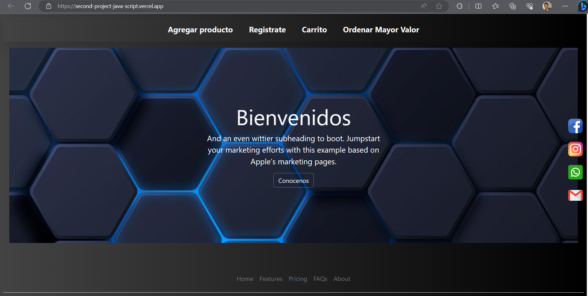
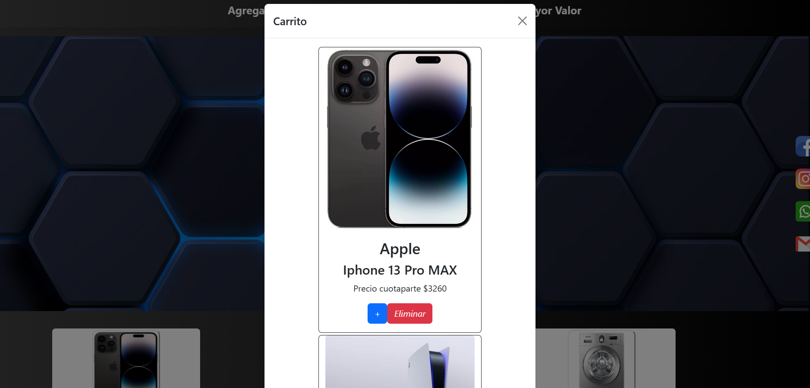
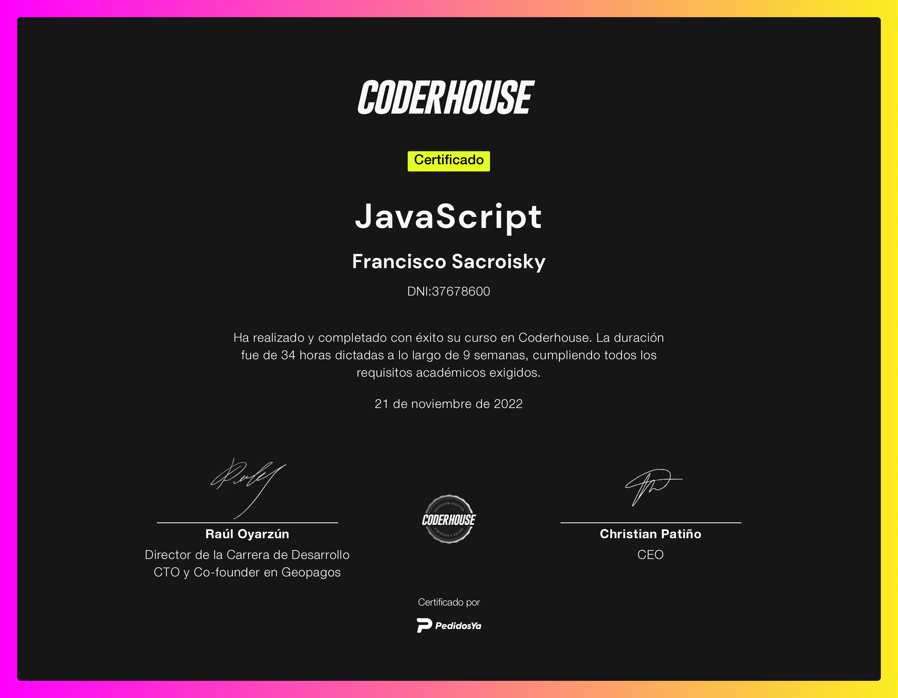

<h1 >🛠️ Second Project JS </h1>

<h2 >This is the Second project for the JavaScript course provided by Coder House.  </h2>

_Final Project in which AJAX and JSON are used to obtain data and various JS tools such as libraries, promises and asynchrony to handle events in the interface and produce animations in response._

*Objective* : Basic e-commerce page.

#  [Page 🚀](https://second-project-java-script.vercel.app/)
### Must be delivered

  <li>Objects and Arrays. Array Methods.
</li>
  <li>Generation of the DOM dynamically. Events.</li>
  <li>Advanced syntax.</li>
    <li>At least one usage library relevant to the project.</li>
      <li>Handling promises with fetch.</li>
        <li>Loading data from a local JSON or from an external API.</li>

 ### 🔩Small sample:

## 📄 Certificate

### 🚀 [Coder House Page](https://www.coderhouse.es/)
